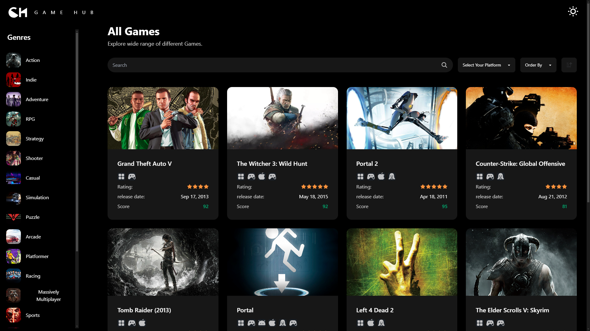
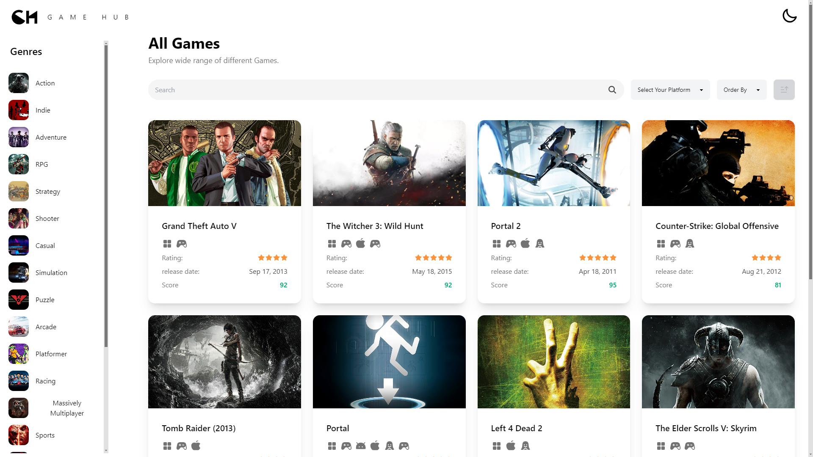
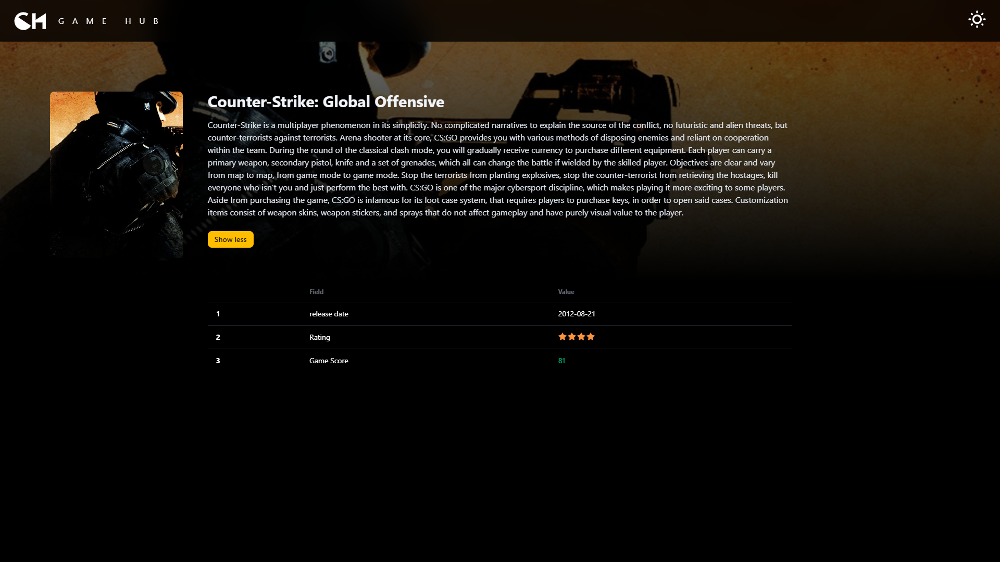
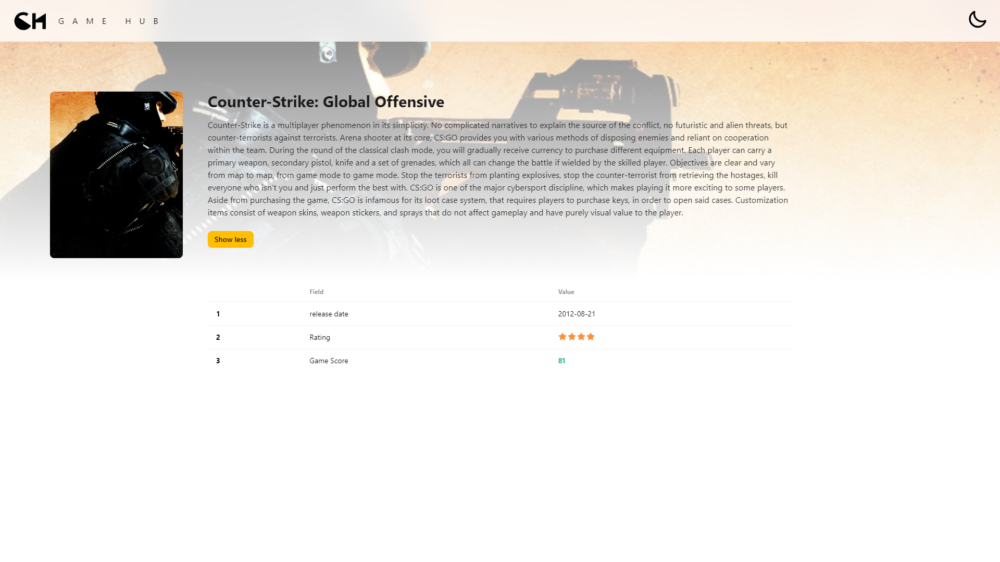

# Game Hub

## 🚀 Brief Overview

Game Hub is a frontend application built with React and Redux for state management, allowing users to search for games by categories, platforms, and more. It offers both dark and light modes, utilizing Tailwind CSS and DaisyUI for styling. The backend API, developed with Node.js and TypeScript, provides comprehensive functionality for handling suppliers, users, products, and orders. Employers can place orders for product quantities from suppliers, manage order statuses, and streamline the entire inventory workflow. The API includes robust features like documentation, testing, and scalable architecture, making it ideal for businesses seeking efficient inventory control. Fully tested and optimized for performance, it's a flexible solution for modern inventory and game search needs.

## ✨ Key Features

1. Responsive Design
2. Awesome Design thanks to **tailwind** and **daisyui**.
3. Nice perfomance
4. Solid state managment thanks to **redux** and **redux-toolkit**.
5. Dual Themes: **Dark** & **Light** Theme
6. Clean and well wrettin Code Thanks to **ESlint** and **Prettier**.

## 🛠️ Tech Stack

- React.js
- **Redux** as a _state manager_
- TailwindCSS
- **daisyui** as a _tailwind ui_.

## 🔧 Install Instructions

1. Clone the repo

```bash
    git clone https://github.com/ahmedmohmd/inventory-app

```

2. Install dependencies

```bash
  yarn install
```

3. Run the App

```bash
  yarn run dev

```

## 🖥️ Usage

1. You can search about games with: `search bar`, `categouries` and `platforms`.
2. You can openany game in its single page to show more details about the game.

## 🖼️ Application's Screeshots

<div style="display: flex; flex-direction: row; justify-content: start; align-items: center; gap: 10px;">
  
  
  
  
<div>
